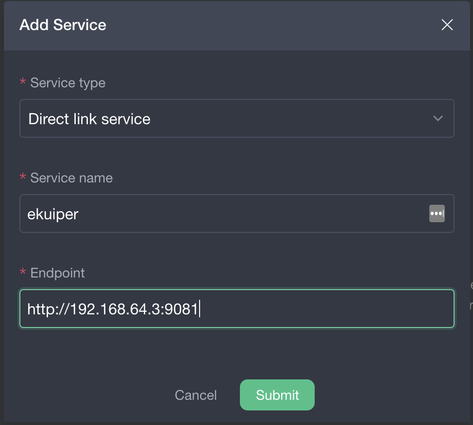

# Deploy eKuiper with OpenYurt

In this tutorial, we will show how to deploy eKuiper in the OpenYurt cluster. To mimic the real scenario where the cloud
node and edge nodes may locate in separate network regions, we use a two-nodes minikube as the experimental cluster. The
eKuiper instance will be deployed to the edge node and the dashboard will be deployed to the cloud node.

## 1. Provision a minikube cluster

Start from version 1.10, minikube allows users to provision multinode clusters. Depending on the version you are using,
minikube may use docker as the default driver, which is not supported by yurt-tunnel. Therefore, make sure to choose
hyperkit or virtualbox as your driver. For example, the OSX user can create a two-nodes minikube cluster by typing the
following command:

```bash
minikube start --nodes 2 --driver hyperkit
```

If everything goes right, we will have a two-nodes cluster up and running:

```bash
$ kubectl get nodes -o wide
NAME           STATUS   ROLES                  AGE   VERSION   INTERNAL-IP    EXTERNAL-IP   OS-IMAGE               KERNEL-VERSION   CONTAINER-RUNTIME
minikube       Ready    control-plane,master   23h   v1.20.7   192.168.64.2   <none>        Buildroot 2020.02.12   4.19.182         docker://20.10.6
minikube-m02   Ready    <none>                 23h   v1.20.7   192.168.64.3   <none>        Buildroot 2020.02.12   4.19.182         docker://20.10.6
```

In the rest of this tutorial, we will assume that the node named `minikube` is the cloud node, and the node
named `minikube-m02` is the edge node.

## 2. Deploy the eKuiper

As an edge streaming software, eKuiper usually deploys in the edge side. We will use eKuiper helm chart to accelerate
the deployment. Please follow
the [eKuiper helm chart tutorial](https://github.com/lf-edge/ekuiper/blob/master/deploy/chart/kuiper/README.md). You
will have two new services running.

```bash
$ kubectl get services
NAME               TYPE        CLUSTER-IP       EXTERNAL-IP   PORT(S)              AGE
ekuiper            ClusterIP   10.99.57.211     <none>        9081/TCP,20498/TCP   22h
ekuiper-headless   ClusterIP   None             <none>        <none>               22h
```

Verify the pods, the ekuiper should run in Make sure it is run in `minikube-m02`.

```bash
$ kubectl get pods -o wide
NAME                        READY   STATUS    RESTARTS   AGE   IP           NODE           NOMINATED NODE   READINESS GATES
ekuiper-0                   1/1     Running   0          22h   10.244.1.3   minikube-m02   <none>           <none>
```

The `ekuiper` rest service is running inside cluster with port 9081. We can check the service connection by typing the
following commands from api server:

```bash
$ minikube ssh
# Inside ssh
$ curl http://192.168.64.3:9081
{"version":"1.2.0","os":"linux","upTimeSeconds":81317}
```

## 3. Deploy the eKuiper dashboard

Add a ekuiper manager deployment and service by `kmanager.yaml` file as below.

```yaml
kind: Deployment
apiVersion: apps/v1
metadata:
  name: kmanager
  namespace: default
  labels:
    app: kmanager
spec:
  selector:
    matchLabels:
      app: kmanager
  template:
    metadata:
      labels:
        app: kmanager
    spec:
      nodeName: minikube
      hostNetwork: true
      containers:
        - name: kmanager
          image: emqx/kuiper-manager:1.1.1
          ports:
            - containerPort: 9082
              protocol: TCP
---
kind: Service
apiVersion: v1
metadata:
  name: kmanager-http
  namespace: default
spec:
  type: NodePort
  selector:
    app: kmanager
  ports:
    - nodePort: 32555
      port: 9082
      targetPort: 9082
```

Running the kubectl command

```bash
$ kubectl apply -f kmanager.yaml
```

Run get service, you should find

```bash
$kubectl get svc
NAME               TYPE        CLUSTER-IP      EXTERNAL-IP   PORT(S)              AGE
ekuiper            ClusterIP   10.109.56.39    <none>        9081/TCP,20498/TCP   120m
ekuiper-headless   ClusterIP   None            <none>        <none>               120m
kmanager-http      NodePort    10.99.154.153   <none>        9082:32555/TCP       15s
kubernetes         ClusterIP   10.96.0.1       <none>        443/TCP              33h
```

Open the [dashboard](http://192.168.64.2:32555) in your browser. Login with default username and password: admin/public.
You should be able to add a kuiper service with the url `http://192.168.64.3:9081`.

1. Create `Add Service` and fill in the form as below.
   
2. After service created, click the service name `ekuiper` and switch to `system` tab. You should connect to the service
   successfully like below screenshot.
   

Now we have setup the ekuiper dashboard in the cloud node that can manage the ekuiper instance in the edge node.

## 4. Block the network traffic from the apiserver to the node

Next, let's block the network traffic from the apiserver to the node by dropping network packages that are sent from the
apiserver to the node. Specifically, we add a nat rule to the cloud node that drops all packets to the node with
destination port set as 10250 (kubelet listens on port 10250 which receives https request from the apiserver).

```bash
$ minikube ssh
                         _             _
            _         _ ( )           ( )
  ___ ___  (_)  ___  (_)| |/')  _   _ | |_      __
/' _ ` _ `\| |/' _ `\| || , <  ( ) ( )| '_`\  /'__`\
| ( ) ( ) || || ( ) || || |\`\ | (_) || |_) )(  ___/
(_) (_) (_)(_)(_) (_)(_)(_) (_)`\___/'(_,__/'`\____)

$ sudo iptables -A OUTPUT -p tcp -d 192.168.64.3 --dport 9081 -j DROP
```

Now, if we try to execute the `curl` command in `ekuiper` service again, the command will hang.

Look at the ekuiper dashboard, the connection is broken now.

## 5. Setup the yurt-tunnel manually

Because we need to connect to port `9081` in the edge, we need to setup the port mapping.
Open `openyurt/config/setup/yurt-tunnel-server.yaml` file and edit the configmap `yurt-tunnel-server-cfg` to add
dnat-ports-pair as below.

```yaml
apiVersion: v1
kind: ConfigMap
metadata:
  name: yurt-tunnel-server-cfg
  namespace: kube-system
data:
  dnat-ports-pair: "9081=10264"
```

It is recommended to use `yurtctl` tool to deploy yurt-tunnel components by adding the `--deploy-yurttunnel` option when
coverting a Kubernetes cluster. For example,

```bash
yurtctl convert --cloud-nodes minikube --provider minikube --deploy-yurttunnel
```

You may also setup the yurt-tunnel manually by deploying yurt-tunnel-server and yurt-tunnel-agent separately.

To set up the yurt-tunnel-server, let's first add a label to the cloud node

```bash
kubectl label nodes minikube openyurt.io/is-edge-worker=false
```

Then, we can deploy the yurt-tunnel-server:

```bash
$ kubectl apply -f config/setup/yurt-tunnel-server.yaml
```

Next, we can set up the yurt-tunnel-agent. Like before, we add a label to the edge node, which allows the
yurt-tunnel-agent to be run on the edge node:

```bash
kubectl label nodes minikube-m02 openyurt.io/is-edge-worker=true
```

And, apply the yurt-tunnel-agent yaml:

```bash
kubectl apply -f config/setup/yurt-tunnel-agent.yaml
```

After the agent and the server are running, we should be able to manage ekuiper from the dashboard again.

## 6. Manage eKuiper in the edge node from dashboard in the cloud node